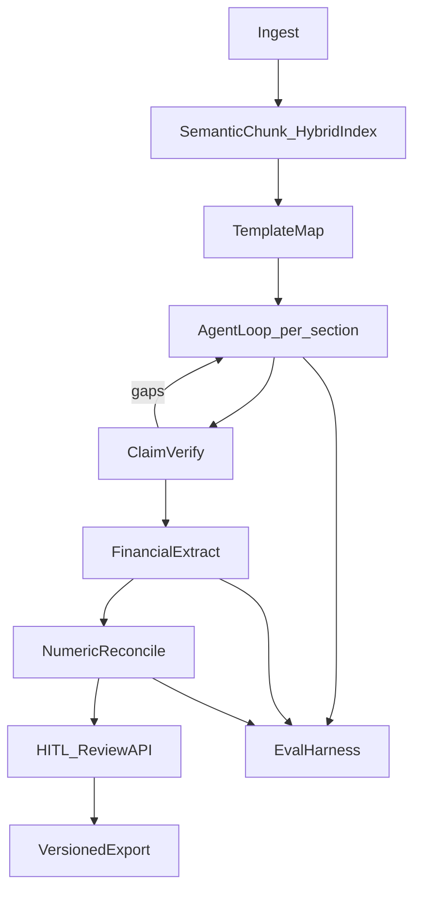

# DMAG Senior AI Engineer Upgrade Plan

Upgrade the existing 8-step pipeline into a measurable, grounded, production-shaped system. All prior suggestions are included; work is sequenced so each phase ships a demoable slice.

## Locked technical choices

- **Vector store:** Chroma (local persistent dir per job) — no external DB required for demos
- **Hybrid retrieval:** dense (Gemini embeddings) + BM25 (`rank_bm25`) with score fusion + optional cross-encoder-free LLM rerank of top-20 → top-k
- **Agent loop:** generate → claim-extract → verify → re-retrieve (max 2 repair rounds)
- **Jobs:** Redis + RQ worker (replace daemon threads); SSE stays
- **Observability:** `structlog` JSON logs + per-job trace IDs (no LangSmith dependency)
- **Packaging:** `backend/pyproject.toml` + installable `dmag` package (remove `sys.path` hacks)



---

## Phase 1 — Schema + claim grounding + agent loop (P0)

**Goal:** Every memo sentence is claim-traceable; confidence is calibrated from verification, not retrieval heuristics.

### Schema ([backend/src/schema.py](backend/src/schema.py), [frontend/src/types.ts](frontend/src/types.ts))

Add:
- `Claim` — `{id, text, citation_ids[], status: supported|unsupported|contradicted|insufficient}`
- `EvidenceChunk` — `{id, doc, page, quote}` used as citation targets
- Extend `MemoSection` with `claims`, `evidence_chunks`, `verification_summary`
- Rewrite `confidence_score` as: `supported_claims / max(total_claims, 1)` (cap unsupported sections below threshold)

### New modules

- [`backend/src/grounding.py`](backend/src/grounding.py) — claim extraction + LLM-as-judge verification against cited quotes only (closed-book)
- [`backend/src/agent_loop.py`](backend/src/agent_loop.py) — per-section loop:
  1. Retrieve top-k
  2. Generate structured JSON: narrative + claims with citation ids
  3. Verify each claim against evidence quotes
  4. If unsupported/contradicted or coverage gaps → rewrite query from gaps, re-retrieve, regenerate (≤2 rounds)
  5. Strip or bracket unsupported claims in final narrative

### Wire into pipeline ([backend/src/pipeline.py](backend/src/pipeline.py), [backend/src/synthesis.py](backend/src/synthesis.py))

- Replace single-shot `Synthesizer.synthesize_section` with `agent_loop.run_section`
- Rename step label from “Agentic Synthesis” to “Grounded Synthesis” in UI/API labels if the loop is the product story (keep README honest)
- Update exporter appendix to map **claims → quotes**, not just section-level citations ([backend/src/exporter.py](backend/src/exporter.py))

### Frontend

- Review page shows per-claim status chips and quote hover ([frontend/src/pages/ReviewPage.tsx](frontend/src/pages/ReviewPage.tsx))
- Metric cards add `supported_claim_rate`

---

## Phase 2 — Retrieval quality (P1)

**Goal:** Better recall for financial jargon; fail loudly; no silent zero-vectors.

### Chunking ([backend/src/chunker.py](backend/src/chunker.py), [backend/src/ingest.py](backend/src/ingest.py))

- Replace fixed 800-char split with recursive/semantic splitter (paragraph → sentence → char) with overlap
- Preserve table rows as atomic chunks where pdfplumber/pandas yields tabular text
- Batch embedding calls; remove blanket `API_DELAY_SEC` sleeps in favor of retry/backoff on 429

### Index + retrieve

- Persist Chroma collection under job `output_dir/chroma/`
- BM25 over same chunk corpus; fuse with dense scores (RRF or weighted sum)
- On embed API failure: **raise** (no `[0.0]*768` fallback)
- Query expansion for section titles (e.g. “Key Financial Metrics” → revenue, EBITDA, margin synonyms) before retrieve

### Config ([backend/src/config.py](backend/src/config.py))

- `CHUNK_SIZE`, `CHUNK_OVERLAP`, `TOP_K`, `RERANK_CANDIDATES`, `MAX_AGENT_ROUNDS`

---

## Phase 3 — Eval harness + tests (P0/P1)

**Goal:** Prove changes don’t regress grounding or reconciliation.

### Layout

```
backend/tests/
  unit/          # ingest, reconcile, normalize, schema
  eval/          # offline quality metrics
backend/evals/
  fixtures/gold_deal/   # sample DD docs + expected.json
  metrics.py
  run_eval.py
```

### Metrics (`backend/evals/metrics.py`)

- Citation/claim support rate
- Unsupported-claim rate
- Reconciliation flag precision/recall vs golden expected flags
- Latency and approx token/cost counters (log-based)

### Tests

- Unit: numeric normalize, reconciler flags, claim schema validation, ingest parsers (fixture files)
- Eval smoke: run pipeline on `gold_deal` with mocked Gemini responses (cassette/fixtures) so CI is free; optional live eval behind `RUN_LIVE_EVAL=1`

### Deps

- `pytest`, `pytest-asyncio`, `rank_bm25`, `chromadb`, `structlog`, `rq`, `redis`

---

## Phase 4 — Numeric financial reconciliation (P1)

**Goal:** Catch real discrepancies; avoid `"52.9B"` vs `"$52,900,000"` false flags.

### New ([backend/src/normalize.py](backend/src/normalize.py))

- Parse currency, multipliers (K/M/B), percents, parentheses negatives
- Canonical metric aliases (`rev`/`revenue`/`net sales`)
- Period normalization (`FY24` → `FY2024`, `TTM`, quarters)

### Upgrade ([backend/src/financial.py](backend/src/financial.py))

- Use structured Gemini output / Pydantic parse for extraction
- Reconcile on `(canonical_metric, period)` with relative tolerance (e.g. 1%)
- Flag messages include normalized values and delta %
- Keep verbatim `source_quote` for audit trail

---

## Phase 5 — Production-shaped backend (P2)

**Goal:** Interview-credible ops story without overbuilding.

### Packaging

- Add [`backend/pyproject.toml`](backend/pyproject.toml); package as `dmag` with `src` layout or `packages = ["dmag"]` mapping current modules
- Fix imports in [`backend/api/main.py`](backend/api/main.py) (drop `sys.path.insert`)
- Root README: `pip install -e backend`, `rq worker`, Redis via Docker Compose

### Jobs ([backend/api/jobs.py](backend/api/jobs.py), [`backend/api/main.py`](backend/api/main.py))

- Replace in-memory + `threading.Thread` with RQ enqueue; job metadata in Redis
- Job TTL + temp-dir cleanup on complete/fail
- Health endpoint checks Redis + Gemini key presence
- Structured logs with `job_id`, `step`, `latency_ms`, `model`

### Resilience

- Retry decorator for Gemini (exponential backoff)
- Surface errors to SSE `failed` with typed error codes

---

## Phase 6 — Real human-in-the-loop (P2)

**Goal:** Review is a workflow, not a banner.

### API

- `PATCH /api/pipeline/{job_id}/sections/{title}` — edit content/claims
- `POST /api/pipeline/{job_id}/sections/{title}/reverify` — re-run grounding only
- `POST /api/pipeline/{job_id}/approve` — mark sections approved; block export until low-confidence sections approved or overridden with reason
- Persist review state JSON beside job output (`review_state.json`)

### Frontend ([frontend/src/pages/ReviewPage.tsx](frontend/src/pages/ReviewPage.tsx), Export page)

- Editable section textarea + claim list
- Approve / Request re-verify actions
- Export page requires approval gate; show version `v1`, `v2` on re-export

### Exporter

- Write versioned filenames: `final_memo_v{n}.docx` + metadata including reviewer decisions

---

## Phase 7 — Docs + interview narrative

- Rewrite [README.md](README.md): architecture diagram, eval how-to, honest limits (no investment judgment; web enrichment still out of scope unless stub removed)
- Delete or clearly mark [`backend/src/web_enrichment.py`](backend/src/web_enrichment.py) as non-shipped
- Short `docs/INTERVIEW.md`: problem → failure modes of v1 → what you built → metrics

---

## Out of scope (explicit)

- Multi-tenant auth / SSO
- Real LinkedIn/G2 enrichment
- Cloud deployment (ECS/K8s)
- Fine-tuning models

---

## Suggested implementation order

1. Schema + grounding + agent loop + Review UI claim chips  
2. Eval fixtures + unit tests (so later phases are measurable)  
3. Hybrid retrieval + Chroma  
4. Numeric reconciler  
5. RQ/Redis + packaging + logging  
6. HITL edit/approve/reverify + versioned export  
7. README / interview doc polish  
