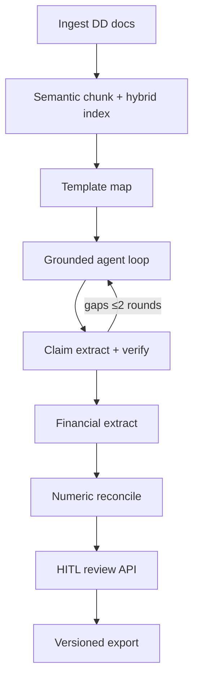

# DMAG — Deal Memo Auto Generator

Automates due diligence packets into a **cited, reviewable** investment memo draft for Associates/Analysts. It drafts and grounds facts from your documents; it does **not** give buy/sell judgment or risk ratings.

## Architecture



| Layer | What it does |
|-------|----------------|
| **Grounded synthesis** | Per-section generate → extract claims → LLM-as-judge vs cited quotes → re-retrieve on gaps (max 2 rounds). Confidence = supported claims / total (capped when unsupported/contradicted). |
| **Hybrid retrieval** | Chroma dense embeddings + BM25 over the same corpus; RRF-style fusion; fail-loud on embed errors (no silent zero-vectors). |
| **Numeric reconcile** | Normalize currency/multipliers/periods; flag discrepancies with relative tolerance. |
| **Jobs** | Redis + RQ workers; SSE progress; typed error codes on failure. |
| **HITL** | Edit / re-verify / approve (or override with reason); export blocked until low-confidence sections clear; versioned `final_memo_v{n}.*`. |

Package layout: installable `dmag` under `backend/dmag/`, FastAPI under `backend/api/`, React UI under `frontend/`.

## How to run

Prerequisites: Python ≥3.11, Node, Docker (for Redis), `GEMINI_API_KEY` in a `.env` at the **repo root**.

```bash
# 1) Redis
docker compose up -d

# 2) Backend package + deps
cd backend
python -m venv .venv && source .venv/bin/activate   # Windows: .venv\Scripts\activate
pip install -e ".[dev]"

# 3) RQ worker (separate terminal; must see Redis)
cd backend && source .venv/bin/activate
rq worker dmag --url redis://localhost:6379/0

# 4) API
cd backend && source .venv/bin/activate
uvicorn api.main:app --reload --port 8000

# 5) Frontend
cd frontend
npm install
npm run dev
```

Open http://localhost:5173 (Vite proxies `/api` → `:8000`). Health: `GET http://localhost:8000/api/health`.

**CLI** (batch, reads `backend/data/raw/`):

```bash
cd backend && source .venv/bin/activate
python -m dmag.app
# or: dmag
```

## Evals & tests

```bash
cd backend && source .venv/bin/activate

# Unit + offline eval smoke (no live Gemini / Redis required)
python -m pytest tests/ -q

# Offline gold_deal cassette metrics
python -m evals.run_eval

# Optional live Gemini eval
RUN_LIVE_EVAL=1 python -m evals.run_eval
```

Fixtures live in `backend/evals/fixtures/gold_deal/`. Metrics include claim support rate, unsupported-claim rate, and reconciliation flag precision/recall vs `expected.json`.

## Honest limits

- **No investment judgment** — drafts and cites; humans approve before export.
- **Closed-book on your packet** — synthesis is gated to uploaded DD; web/LinkedIn/G2 enrichment is **not shipped** (see `backend/dmag/web_enrichment.py`).
- **LLM judgment is fallible** — claim verification is model-based; HITL is the safety net.
- **Local demo ops** — Redis+RQ is production-*shaped*, not multi-tenant auth, cloud deploy, or SSO.

## Structure

```
frontend/                 # React + Vite HITL UI
backend/
  api/                    # FastAPI: run, SSE, HITL, health
  dmag/                   # Pipeline package (grounding, agent loop, export, …)
  evals/                  # Metrics + gold_deal fixtures
  tests/                  # pytest unit + eval smoke
  data/raw/               # CLI input docs
  templates/              # memo_template.docx
  output/                 # CLI exports
docker-compose.yml        # Redis
docs/INTERVIEW.md         # Interview narrative
```

## Proposal alignment

| Requirement | Implementation |
|-------------|----------------|
| Workflow | DD → grounded memo draft + citations |
| Goal | Automate drafting; **no** investment judgment |
| Inputs | PDF, CSV, Excel, Word, .txt, optional memo template |
| Outputs | Editable docx, claim→quote appendix, CRM JSON, versioned HITL packages |
| Safety | Evidence gating, numeric flags, confidence gate + human approval |
