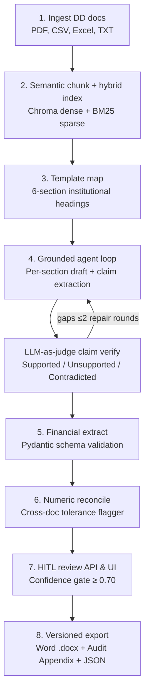

# DMAG — Deal Memo Auto Generator

Automates due diligence packets into a **cited, reviewable** investment memo draft for Private Equity / Venture Capital Associates and Analysts. It extracts and grounds facts directly from uploaded deal documents; it does **not** give buy/sell judgment or subjective risk ratings.

---

## Architecture



| Layer | What it does |
|---|---|
| **Grounded Synthesis** | Per-section generation $\rightarrow$ atomic claim extraction $\rightarrow$ LLM-as-judge verification against verbatim cited quotes $\rightarrow$ self-repair re-retrieval on gaps ($\le 2$ rounds). Confidence = $\frac{\text{supported claims}}{\text{total claims}}$ (capped at 0.69 if unverified claims exist). |
| **Hybrid Retrieval** | Dense embeddings (ChromaDB + `gemini-embedding-001`) + Sparse keyword search (BM25) over the same corpus; Reciprocal Rank Fusion (RRF, $k=60$). Built-in DNS-over-HTTPS (DoH) fallback for enterprise/campus firewalls. |
| **Numeric Reconcile** | Normalizes currencies, multipliers, and fiscal periods; flags cross-document discrepancies with 1% relative tolerance formula $\frac{\|a - b\|}{\max(\|a\|, \|b\|)} > 0.01$. |
| **Jobs & Streaming** | Redis + RQ background workers; Server-Sent Events (SSE) real-time progress stream; typed error codes on failure. |
| **HITL Safety Gate** | Edit / re-verify / approve; final export locked until all sections meet the $\ge 0.70$ confidence threshold or are explicitly overridden with an audit rationale; versioned `final_memo_v{n}.docx`. |

Package layout: installable `dmag` under `backend/dmag/`, FastAPI under `backend/api/`, React UI under `frontend/`.

---

## How to Run

### Prerequisites
* Python $\ge 3.11$
* Node.js $\ge 18$
* Docker Desktop (for Redis)
* `GEMINI_API_KEY` in a `.env` file at the repository root

---

### Option A: 1-Click Launch on Windows (Recommended)

Run the included PowerShell launcher from the repo root:
```powershell
.\run_demo.ps1
```
This automatically:
1. Starts/unpauses the Redis Docker container (`localhost:6379`).
2. Starts the cross-platform RQ Worker (`python -m api.worker`) using `rq.SimpleWorker`.
3. Starts the FastAPI backend (`http://localhost:8000`).
4. Starts the Vite frontend dev server (`http://localhost:5173` or `http://localhost:5174`).
5. Shuts down all processes cleanly when you press `Ctrl+C`.

---

### Option B: Manual Multi-Terminal Startup

```bash
# 1) Start Redis
docker compose up -d

# 2) Install backend package
cd backend
python -m venv .venv
# Windows: .venv\Scripts\activate
# macOS/Linux: source .venv/bin/activate
pip install -e ".[dev]"

# 3) Start RQ Worker (separate terminal)
# Windows:
python -m api.worker
# or: rq worker dmag --worker-class rq.SimpleWorker --url redis://localhost:6379/0
# macOS/Linux:
rq worker dmag --url redis://localhost:6379/0

# 4) Start FastAPI backend (separate terminal)
uvicorn api.main:app --reload --port 8000

# 5) Start Frontend UI (separate terminal)
cd frontend
npm install
npm run dev
```

Open `http://localhost:5173` (or `http://localhost:5174`). 
API Health check: `GET http://localhost:8000/api/health`.

---

### CLI Batch Mode (Headless)

To process documents locally without the web UI:
```bash
cd backend
python -m dmag.app
# or: dmag
```
Reads due diligence materials from `backend/data/raw/` and exports to `backend/output/final_memo.docx`.

---

## Evals & Tests

```bash
cd backend

# 1. Run all unit tests (grounding, normalize, reconcile, template mapper)
python -m pytest tests/ -q

# 2. Run offline evaluation against gold_deal cassette
python -m evals.run_eval

# 3. Optional: Live Gemini evaluation
RUN_LIVE_EVAL=1 python -m evals.run_eval
```

Fixtures live in `backend/evals/fixtures/gold_deal/`. Metrics include claim support rate, unsupported claim rate, and reconciliation flag precision/recall/F1 vs `expected.json`.

---

## 6-Section Institutional Template

The pipeline populates a 6-section Private Equity investment memo template (`backend/templates/memo_template.docx`):
1. **Executive Summary** — Deal overview, target company, transaction context.
2. **Market & Industry Overview** — Market sizing, growth CAGRs, competitive landscape.
3. **Business & Product Overview** — Business model, products, properties, revenue drivers.
4. **Key Financial Metrics** — Revenue, EBITDA, margins, historical vs projected table.
5. **Management & Organization** — Key executive backgrounds, roles, and tenures.
6. **Key Risks & Diligence Findings** — Operational risks, customer concentration, debt.
7. **Appendix: Evidence & Citations** — Audit trail mapping every claim to an exact quote and page number.

---

## Honest Limits

* **No investment judgment** — Drafts and cites facts; humans make buy/sell decisions.
* **Closed-book on your packet** — Synthesis is strictly gated to uploaded DD documents; web/external enrichment is not shipped.
* **LLM judgment is fallible** — Claim verification is model-based; the HITL review interface is the required safety net.
* **Local demo ops** — Redis + RQ is production-*shaped* for local demos, not multi-tenant cloud auth or SSO.

---

## Project Structure

```
run_demo.ps1              # 1-click Windows launcher (Docker, Worker, API, Vite)
frontend/                 # React 18 + Vite + TypeScript HITL UI
  src/pages/DealRoom.tsx  # Document upload dropzone & template selector
  src/pages/ReviewPage.tsx# Human-in-the-loop review, claim badges, re-verify
  src/pages/ExportPage.tsx# Versioned export manager (locked below 0.70 confidence)
backend/
  api/
    main.py               # FastAPI application & REST endpoints
    jobs.py               # Redis + RQ job store & SSE event publisher
    worker.py             # Cross-platform RQ worker (SimpleWorker for Windows)
    review.py             # HITL review state, section edit, reverify, & approval gate
  dmag/
    ingest.py             # Multi-format document parser (pdfplumber, pandas, docx)
    chunker.py            # Semantic chunking, Chroma dense vectors, BM25, & RRF
    synthesis.py          # Template mapping & section orchestrator
    agent_loop.py         # Grounded agent loop (retrieve → draft → verify → repair)
    grounding.py          # Atomic claim extraction & LLM-as-judge verification
    financial.py          # Pydantic financial metric extractor
    reconcile.py          # Numeric normalization & relative tolerance reconciler
    exporter.py           # docxtpl Word renderer & verbatim quote appendix builder
    gemini_client.py      # Retries, exponential backoff, & DoH DNS fallback
  templates/              # memo_template.docx (6 institutional sections)
  evals/                  # Metrics harness & gold_deal fixtures
  tests/                  # pytest unit & integration tests
  data/raw/               # Default sample due diligence materials
  output/                 # Generated final_memo.docx & CRM JSON
docker-compose.yml        # Redis container configuration
```
