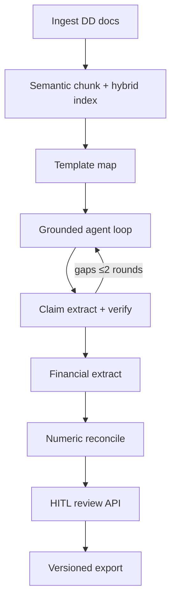

# DMAG Demo Guide — Why v2 Beats “Naive RAG”

This guide is for walking through a live or recorded demo of **DMAG (Deal Memo Auto Generator)**. It explains the product problem, what broke in v1, how the current architecture fixes those failure modes, and several end-to-end use cases you can show.

**One-liner:** DMAG turns a messy due diligence packet into a **cited, reviewable** investment memo draft. It drafts and grounds facts from your documents; it does **not** give buy/sell judgment or risk ratings.

---

## Who this is for

| Audience | What they care about |
|----------|----------------------|
| **PE Associates / Analysts** | Hours back on memo drafting; every number auditable; export only after review |
| **Engineering / interviewers** | Grounding loop, hybrid retrieval, reconcile, jobs, HITL gates, evals |
| **Ops / demo hosts** | Reproducible local run path; honest limits; what not to promise |

---

## The problem in one minute

Associates still spend hours turning CIM PDFs, financial CSVs, tax returns, and meeting notes into a structured memo with citations. The draft must be:

1. **Auditable** — every material claim maps to a quote or cell in the packet  
2. **Safe** — no invented facts, no silent numeric contradictions  
3. **Accelerating** — automates drafting; humans keep investment judgment  

A fluent paragraph generator is not enough. Fluency without evidence is a liability in diligence.

---

## v1 vs current system (why this version wins)

v1 was essentially *“chunk → retrieve → ask the model to write sections.”* It looked impressive until you checked sources and numbers.

| Failure mode (v1) | What went wrong | What we ship now | Demo moment |
|-------------------|-----------------|------------------|-------------|
| **Ungrounded prose** | Fluent sentences with no claim→quote trail; “confidence” was a retrieval score | Claim extract → LLM-as-judge vs cited quotes; confidence = supported / total (capped on unsupported/contradicted) | Open a section, show claim appendix + confidence |
| **Brittle retrieval** | Fixed char chunks + dense-only; jargon miss; embed failures could fail soft | Semantic chunking + Chroma + BM25 fusion (RRF-style); fail loud on embed errors | Show hybrid hits for a ticker-style metric name |
| **False reconcile flags** | `$52.9M` vs `52900000`, `FY24` vs `FY2024` looked like conflicts | Normalize currency, multipliers, periods; relative-tolerance compare | Flip a unit/period and show flag disappear / appear correctly |
| **Toy job runner** | In-memory threads; weak health/errors | Redis + RQ; SSE progress; typed error codes; `/api/health` | Kill Redis briefly → typed failure in UI/logs |
| **HITL as a banner** | UI said “review” but export still worked | Edit → re-verify → approve/override with reason; downloads blocked until low-confidence sections clear; versioned `final_memo_v{n}.*` | Try export before approve → blocked; after approve → versioned files |

**Talking point:** *We didn’t optimize for prettier prose—we measured whether claims are supported, whether numeric flags are real, and whether a human can block a bad export.*

---

## Architecture walkthrough (keep this short in demo)



| Layer | Demo-friendly explanation |
|-------|---------------------------|
| **Grounded synthesis** | Per-section: generate → extract claims → judge vs quotes → re-retrieve on gaps (max 2 rounds) |
| **Hybrid retrieval** | Dense + BM25 over the same corpus; miss rates drop on financial jargon |
| **Numeric reconcile** | Canonical (metric, period) after normalization; relative tolerance |
| **Jobs** | Enqueued work, SSE progress, typed failures—not a fire-and-forget thread |
| **HITL** | Real gate: edit / re-verify / approve; versioned export packages |

Package layout: installable `dmag` (`backend/dmag/`), FastAPI (`backend/api/`), React HITL UI (`frontend/`).

---

## Demo setup (local)

Prerequisites: Python ≥3.11, Node, Docker (Redis), `GEMINI_API_KEY` in a `.env` at the **repo root**.

```bash
# 1) Redis
docker compose up -d

# 2) Backend
cd backend
python -m venv .venv && source .venv/bin/activate
pip install -e ".[dev]"

# 3) Worker (separate terminal)
cd backend && source .venv/bin/activate
rq worker dmag --url redis://localhost:6379/0

# 4) API
cd backend && source .venv/bin/activate
uvicorn api.main:app --reload --port 8000

# 5) Frontend
cd frontend && npm install && npm run dev
```

Open http://localhost:5173. Health: `GET http://localhost:8000/api/health`.

**Offline proof (no live Gemini / no Redis):**

```bash
cd backend && source .venv/bin/activate
python -m pytest tests/ -q
python -m evals.run_eval
```

Optional live eval: `RUN_LIVE_EVAL=1 python -m evals.run_eval`.

Fixtures: `backend/evals/fixtures/gold_deal/` (CIM, financials, tax return, meeting notes, `expected.json`, optional Gemini cassette).

---

## Suggested 12-minute demo script

| Minute | Scene | Say / show |
|--------|-------|------------|
| 0–1 | Problem | Diligence packet ≠ memo; associates need citations, not vibes |
| 1–3 | v1 postmortem | Ungrounded text, false flags, ungatable export |
| 3–6 | Happy path | Upload packet → progress SSE → review UI with confidence |
| 6–8 | Grounding | Pick a section; claim → quote; note brackets / low confidence |
| 8–10 | Numbers + HITL | Reconcile flag; edit → re-verify → approve → versioned export |
| 10–12 | Proof + limits | Eval metrics; closed-book; no buy/sell judgment |

---

## Use cases (demo scenarios)

Use these as distinct scenes. Prefer the **gold_deal** fixture when you need a deterministic story; use a custom packet when you want live Gemini.

### Use case 1 — First-pass CIM → structured draft (happy path)

**Persona:** Associate receiving a new package on Monday morning.

**Inputs:** CIM (PDF/txt), management presentation notes, optional memo template.

**Flow:**

1. Upload docs in the UI (or drop into `backend/data/raw/` for CLI `python -m dmag.app`).
2. Watch job progress over SSE (not a silent spinner).
3. Land on Review with section drafts, confidence, and source trail.

**Why better than v1:** Sections are not just “retrieved + paraphrased”—claims are extracted and judged against cited quotes. Low support rate lowers confidence instead of a vague retrieval score.

**Show:** One high-confidence section (e.g. business overview) next to one thinner section (sparse notes) to prove confidence is evidence-driven.

---

### Use case 2 — Financials that conflict across sources

**Persona:** Analyst reconciling CIM revenue table vs tax return vs spreadsheet.

**Inputs:** `financials.csv` + Tax Return + CIM revenue language (as in `gold_deal`).

**Flow:**

1. Run pipeline through financial extract + numeric reconcile.
2. Surface flags where metrics disagree after **normalization** (units, `$`/`B`/`M`, period labels).
3. Analyst inspects flag → decides edit or override with reason.

**Why better than v1:** v1 waved false positives on format differences (`"52.9M"` vs `52900000`, `FY24` vs `FY2024`). v2 normalizes first, then compares with relative tolerance on canonical (metric, period).

**Show:** A real discrepancy vs a “looks different but same number” non-flag—both in one packet if possible.

---

### Use case 3 — Sparse packet / missing evidence (agent loop)

**Persona:** Associate with an incomplete preliminary drop (CIM only, no bank book).

**Flow:**

1. Generate a section that needs ops metrics not in the packet.
2. Agent loop: verify claims → gaps → re-retrieve (≤2 rounds).
3. Residual unsupported text is bracketed / confidence capped—not quietly asserted.

**Why better than v1:** v1 filled gaps with plausible inventiveness. v2 stays closed-book on the uploaded packet and surfaces incompleteness for HITL.

**Talking point:** *Missing evidence is a feature of diligence, not a bug to paper over.*

---

### Use case 4 — HITL gate before IC-facing export

**Persona:** Senior associate who will not put an unreviewed draft in the data room.

**Flow:**

1. Attempt export while low-confidence sections remain → **blocked**.
2. Edit a shaky sentence / number in the review UI.
3. Re-verify affected claims.
4. Approve (or override with a written reason).
5. Download versioned package: editable docx, claim→quote appendix, CRM JSON (`final_memo_v{n}.*`).

**Why better than v1:** v1 showed a “needs review” banner and still exported. v2 makes export a **capability unlock**, not decoration—and versions each approved release.

**Show:** Before/after file names (`v1` → `v2`) after a forced re-approve.

---

### Use case 5 — Hybrid retrieval on “un-embeddable” jargon

**Persona:** Demo for eng / interviewers who ask “why not just Chroma?”

**Flow:**

1. Query a term that BM25 loves (exact ticker-ish codes, odd account names, OCR quirks).
2. Contrast with a semantic paraphrase question (“why did margins expand?”).
3. Explain RRF-style fusion over the same semantic chunks.

**Why better than v1:** Dense-only + char chunks missed terminology; soft embed failures could empty the index silently. Hybrid + fail-loud avoids confident nonsense from empty context.

---

### Use case 6 — Job reliability under infra hiccups

**Persona:** Demo for “is this production-shaped?” skeptics.

**Flow:**

1. Show `/api/health` while Redis is up.
2. Stop Redis / worker briefly mid-run or before enqueue.
3. Surface typed SSE / API error codes (not a generic 500 banner).
4. Restart stack; re-run cleanly with `job_id` in structured logs.

**Why better than v1:** In-memory threads don’t survive restarts, don’t queue, and don’t compose with health checks. Redis + RQ is still a **local demo ops** setup—but it’s the shape you’d harden later.

**Honest caveat:** Not multi-tenant auth, not K8s, not SSO—say that out loud.

---

### Use case 7 — Offline eval as regression proof

**Persona:** Interviewer asking “how do you know it got better?”

**Flow:**

1. Run `python -m pytest tests/ -q` and `python -m evals.run_eval` on `gold_deal`.
2. Call out metrics:
   - Supported claim rate  
   - Unsupported / contradicted rate  
   - Reconcile flag precision & recall vs `expected.json`  
   - Latency / cost from logs (approx)

**Why better than v1:** v1 had anecdotal demos. v2 has a cassette path for CI-friendly offline scoring and an optional live Gemini gate (`RUN_LIVE_EVAL=1`).

**Talking point:** *Success is measurable claim support and real flags—not memo eloquence.*

---

### Use case 8 — CRM / machine-readable handoff

**Persona:** Ops wanting the memo in a system of record, not only Word.

**Flow:**

1. Complete HITL approval.
2. Export JSON alongside docx + claim appendix.
3. Walk one field: company name, key metric with period, citation pointer.

**Why better than v1:** Outputs are deliberate packages for humans **and** downstream systems—gated by the same approval path.

---

### Use case 9 — What we deliberately do *not* do (negative use cases)

Use these when someone asks for LinkedIn scrapes, buy recommendations, or auto-risk scores.

| Ask | Correct product answer |
|-----|------------------------|
| “Rate this deal 1–10” | Out of scope—drafts and cites only; humans own judgment |
| “Enrich from G2 / LinkedIn / web” | Not shipped (`web_enrichment.py` is placeholder); synthesis is closed-book on the packet |
| “Just export for me, skip review” | Blocked when confidence gate fails; override requires reason |
| “Trust LLM confidence alone” | Verification is model-based and fallible—HITL is the safety net |

Showing restraint builds trust faster than feature sprawl.

---

## Proposal / requirements alignment (quick table)

| Requirement | Demo proof |
|-------------|------------|
| DD → grounded memo draft + citations | Review UI + claim appendix |
| Automate drafting; **no** investment judgment | No buy/sell score in UI or exports |
| Inputs: PDF, CSV, Excel, Word, .txt, optional template | Multi-file upload / `data/raw/` |
| Outputs: editable docx, claim→quote appendix, CRM JSON, versioned HITL packages | Export step after approve |
| Safety: evidence gating, numeric flags, confidence + human approval | Blocked export + reconcile flags |

---

## Honest limits (say these in every demo)

- **No investment judgment** — drafts and cites; humans approve before export.  
- **Closed-book on your packet** — web/LinkedIn/G2 enrichment is not shipped.  
- **LLM judgment is fallible** — claim verification is model-based; HITL is the safety net.  
- **Local demo ops** — Redis+RQ is production-*shaped*, not multi-tenant cloud SSO.

---

## Checklist before you present

- [ ] Redis up; worker connected; API health green  
- [ ] `.env` has `GEMINI_API_KEY` (or rely on offline cassette eval only)  
- [ ] Sample packet ready (`gold_deal` or sanitized real CIM)  
- [ ] Know one intentional numeric conflict and one formatting non-conflict  
- [ ] Know how to show blocked export → approve → `final_memo_v{n}`  
- [ ] One slide or verbal line on eval metrics  

---

## Closing line

DMAG is better than v1 not because the prose is nicer, but because **every section earns its confidence from claim-level evidence**, **numbers are reconciled after normalization**, and **export is gated by a real human workflow**—backed by jobs, health, and measurable evals instead of a demo-day script.
